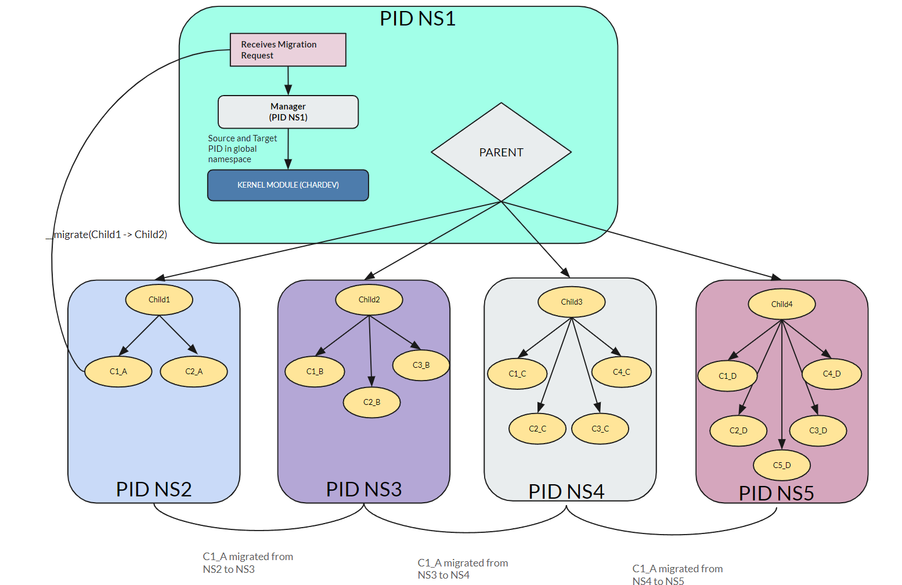

# Experimental Setup

The experimental setup is designed to assess the effectiveness of the proposed namespace migration mechanism, focusing on ```chained execution``` in different namespaces with ```state forwarding```. The setup comprises a ```hierarchical structure``` of processes across multiple PID namespaces, with migration initiated by a child process in response to a computation trigger. There is a ```manager``` service running in the global namespace that accepts socket connection and receives migration requests. The setup is shown below. 




The following components constitute the experimental environment:-

## VI.I Process Hierarchy and PID Namespace Creation

* ```Parent Process (NS1)```: Initiates the experimental setup and spawns four child processes in four distinct PID namespaces (```NS2, NS3, NS4, NS5```).

* ```Child1 (NS2)```: Spawns 2 child processes. ```C1_A``` is the process that will do chained execution.

* ```Child2 (NS3), Child3 (NS4), Child4 (NS5)```: Spawns 3, 4, and 5 children respectively who just loops in a infinite loop.

## Migration Trigger and Manager Mechanism

* <b>Computation-Triggered Migration (NS2 to NS3 to NS4 to NS5)</b>: One child process under ```NS2``` performs a computation (increment a variable 100 times in a loop) and sends a migration request to the manager process running a socket in the global namespace. This sets in motion the chained migration process across different PID
namespaces.

* <b>Manager Process</b>: Receives migration requests and triggers the migration process by making a ```__migrate``` call to the library, which further invokes the kernel module responsible for performing the migration.

## Observations and Demonstrations
The child process in NS2 prints the computed value (initially 100) and its PID(3) before initiating migration to NS3. After migration, the process repeats the computation, printing the computed value(200)
and its PID(5) in the new namespace (NS3). This process is repeated for NS4(300, 6) and NS5(400, 7), demonstrating chained execution with state forwarding across multiple namespaces.